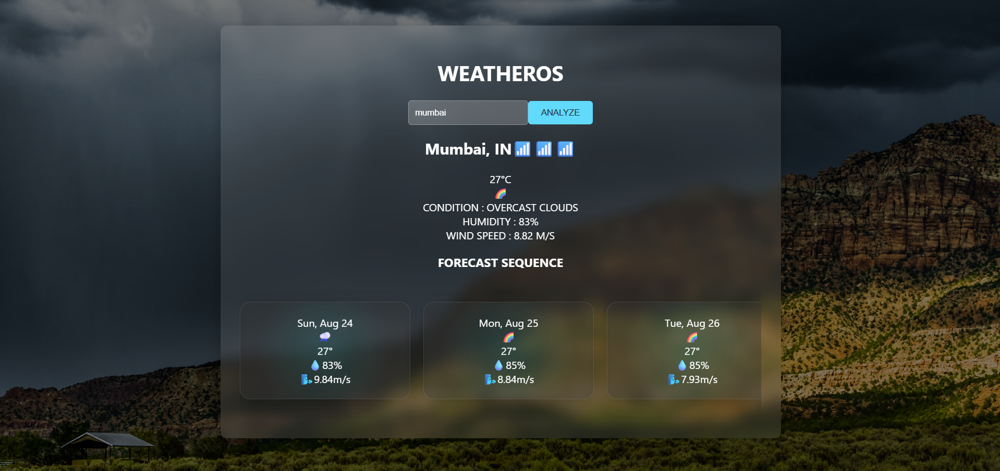

## Preview

<p align="center">
  
</p>


# Weathyy

A sleek and user-friendly weather application that fetches real-time meteorological data for any location.

---

##  Features

- Retrieve current weather conditions such as temperature, humidity, wind speed, and weather description.
- Search by city name or use current geolocation.
- Clean and intuitive user interface optimized for quick weather checks.

---

##  Tech Stack

- **Frontend**: HTML5, CSS3, JavaScript (or your actual frontend technologies)
- **Backend**: Node.js, Express.js (if applicable)
- **APIs**: [e.g., OpenWeatherMap API] for real-time weather data
- **Deployment**: GitHub Pages / Vercel / Netlify (or your actual deployment platform)

---

##  Installation & Setup

1. **Clone the repository**  
   ```bash
   git clone https://github.com/Piyush-ouch/weathyy.git
   cd weathyy
